# PointMAR: Point Masked Continuous Auto-Regressive Model

This repository implements PointMAR (Point Masked Auto-Regressive model) for 3D point-cloud modeling and generation.

<p align="center">
    
    <!-- 
     -->
	<a href="https://colab.research.google.com/drive/1aSl3hx78rLjfTRQ-nSnZptwWKFA_-Iej?usp=sharing">
		
	</a>
	<a href="https://huggingface.co/kohido/shapenet_mar_base_1024pts_3dim">
		
	</a>
</p>

## 1) Environment Setup

- Requirement: Python 3.10+ and a CUDA-enabled PyTorch build if you intend to train on GPUs.
- Recommended: create a virtual environment and install package dependencies declared in `pyproject.toml`.

Example (venv + editable install):

```bash
python -m venv .venv
source .venv/bin/activate
python -m pip install --upgrade pip
python -m pip install -e .
```

Notes:
- `pip install -e .` will install the dependencies listed in `pyproject.toml`.

Conda setup (recommended for GPU/CUDA toolkits)

The repository includes a small helper `setup.sh` that can create and populate a conda environment. Example:

```bash
# create and activate an environment named `pointmar-env` in ./envs/
./setup.sh pointmar-env
conda activate ./envs/pointmar-env
```

What the script does (high level):
- create a conda env with Python 3.10
- install the NVIDIA CUDA toolkit (12.9)
- pip-install PyTorch wheel (cu129 index) and a few dev deps
- pip install -e . (editable install)

- If you prefer a requirements file, generate one from the pyproject or install packages individually.

## 2) How to run

Training (single-node):

```bash
python main.py \
	--model mar_small \
	--dataset_name shapenet \
	--data_path /path/to/dataset_cache_or_root \
	--batch_size 8 \
	--epochs 100 \
	--output_dir ./outputs/myrun
```

Distributed training with torchrun:

```bash
MASTER_ADDR=<master-ip> MASTER_PORT=29500 \
torchrun --nnodes=2 --nproc_per_node=4 --rdzv_id=myrun --rdzv_backend=c10d \
		main.py --model mar_small --dataset_name shapenet --data_path /shared/dataset --output_dir /shared/outputs/myrun
```

Important flags and files:
- `--world_size` should equal `nnodes * nproc_per_node` if you pass it; otherwise torchrun sets env vars and the code uses them.
- `main.py` writes `config.json` and `setup.txt` to `--output_dir`.

Provided convenience scripts
- `scripts/shapenet_1024.sh` — single-node example for training `mar_base` on ShapeNet (1024 pts). It prepares an OUTPUT_DIR timestamp and runs `torchrun` with sensible defaults.
- `scripts/mesh500_1024.sh` — single-node example for Mesh500 with `mar_pico`.

Deploy manifests
- `deploy/mg/shapenet/` and `deploy/mn/shapenet/` contain Kubernetes / MNJob manifests used to run distributed jobs in an on-prem cluster. They demonstrate:
	- cloning the repo on pod start
	- logging into wandb via secret (if enabled)
	- launching `torchrun` with multi-node arguments and environment variables (RDZV endpoint, node-rank, etc.)

Deploy notes / pitfalls
- Ensure a shared PVC (e.g., mounted at `/mnt/project`) is used by all replicas when you expect a single shared `--output_dir`.
- Do not hardcode mismatched `--world_size` — set it to `nnodes * nproc_per_node` or omit and let torchrun manage it.
- Provide `MASTER_ADDR` and `MASTER_PORT` env vars (or use a rendezvous service) so all nodes can rendezvous.


Sampling (example usage from Python):

```python
from pointmar.models import mar_small
import torch

model = mar_small(num_points=1024, token_embed_dim=3)
model.eval()
# load weights if available: model.load_state_dict(torch.load('checkpoint.pth'))
samples = model.sample_tokens(bsz=4, num_iter=64, temperature=1.0)
# samples: Tensor shape (bsz, seq_len, token_embed_dim)
```

For conditioned sampling from real points use `model.sample_tokens_from_points(init_points, ...)` (see `pointmar/models/mar.py`).

## 3) Demo

- Interactive gallery: `docs/index.html` — a three.js based viewer that expects point-cloud PLY files at `docs/samples/<model_key>/ply/sample_<i>.ply`.

Run a simple static server to view the demo locally:

```bash
python -m http.server --directory docs 8000
# open http://localhost:8000 in your browser
```

The demo page loads 27 samples arranged in a 3x9 grid and provides orbit controls per cell.

Demo table

| Dataset | #Points | #Params (approx) | Checkpoint | Demo |
|---|---:|---:|---|---|
| ShapeNet(V1+V2) | 1024 | ~209M | <a href="https://huggingface.co/kohido/shapenet_mar_base_1024pts_3dim">🤗 HF</a> |  <a href="https://colab.research.google.com/drive/1aSl3hx78rLjfTRQ-nSnZptwWKFA_-Iej?usp=sharing">📓 Colab</a> |

Notes:
- `#params` is an approximate model size — the exact number is printed at model creation in `main.py` (the script prints trainable parameters).
- The checkpoint and colab demo links point to a precomputed model and a runnable Colab demonstrator.

## Results

We provide 27 rendered 360° videos of sampled point clouds in `docs/samples/shapenet_mar_base_1024pts_3dim/video/`. You can view them as a 3 (width) × 9 (height) grid at:

- `docs/videos_grid.html` (static page in the repo). It loads the 27 `*_360view.mp4` files from the samples folder and displays them in a responsive grid.

If you prefer to browse locally, run the docs server and open the page:

```bash
python -m http.server --directory docs 8000
# open http://localhost:8000/videos_grid.html
```

### Results — GIF gallery (inline)

The GIFs below are converted from the 360° MP4 renders and embedded inline for quick preview. (If the README loads slowly, use `docs/videos_grid.html` or view the `docs/samples/.../video` folder.)

| Sample 0 | Sample 1 | Sample 2 |
|---|---|---|
| 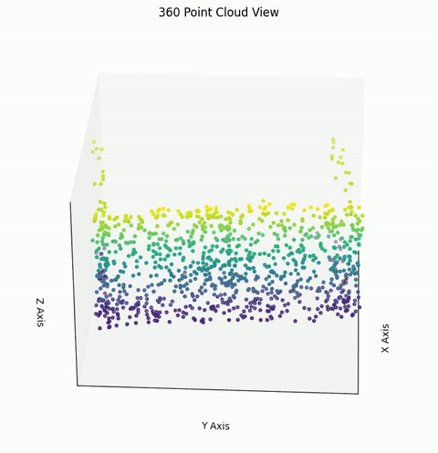 | 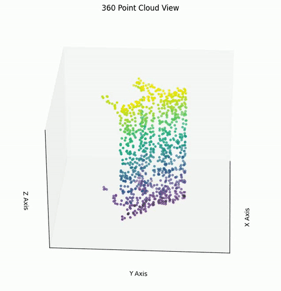 | 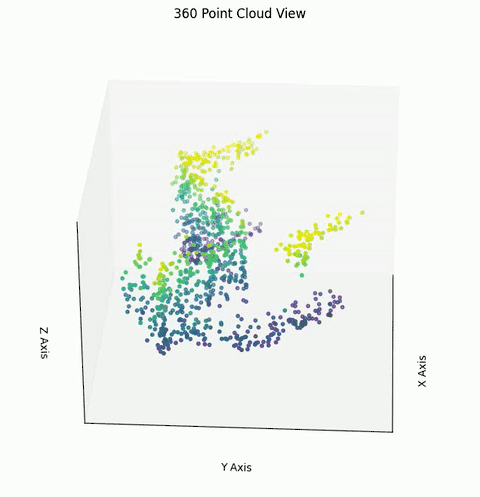 |

| Sample 3 | Sample 4 | Sample 5 |
|---|---|---|
| 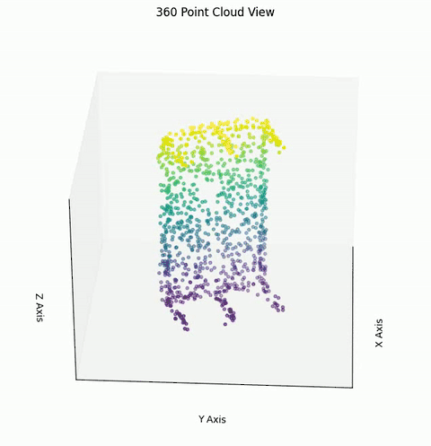 | 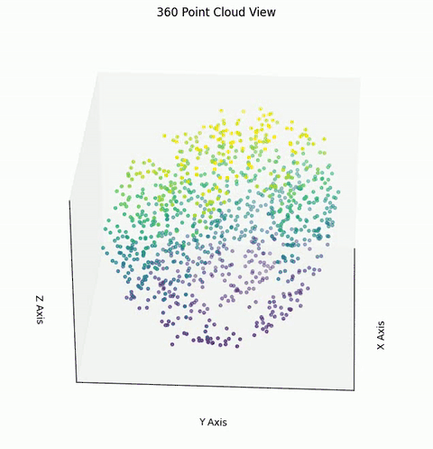 | 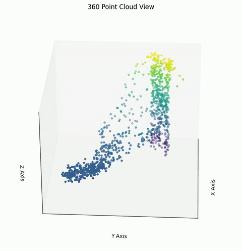 |

| Sample 6 | Sample 7 | Sample 8 |
|---|---|---|
| 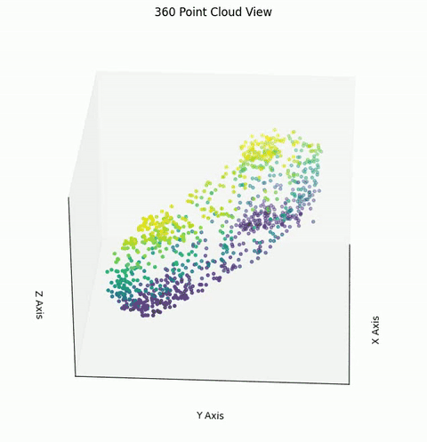 | 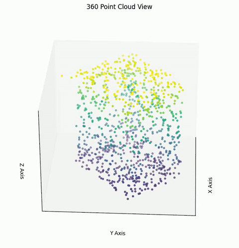 | 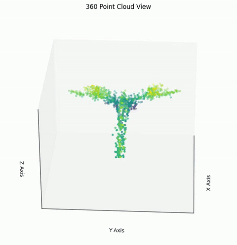 |

| Sample 9 | Sample 10 | Sample 11 |
|---|---|---|
| 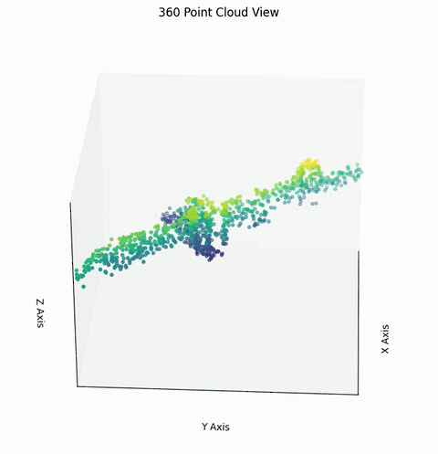 | 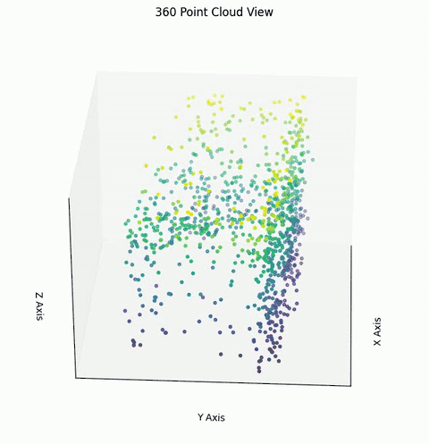 | 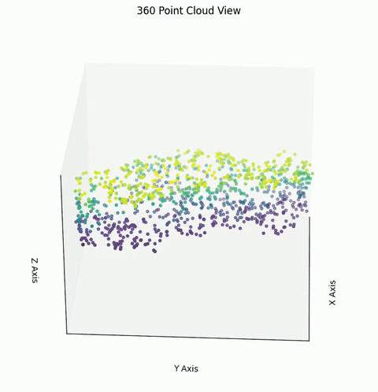 |

| Sample 12 | Sample 13 | Sample 14 |
|---|---|---|
| 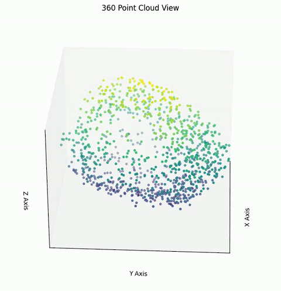 | 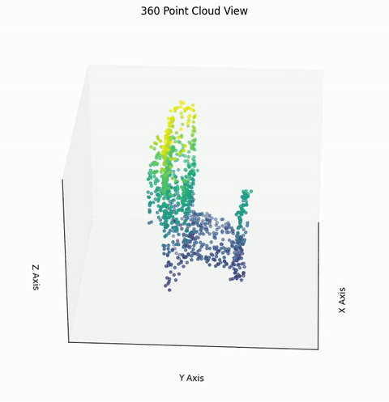 | 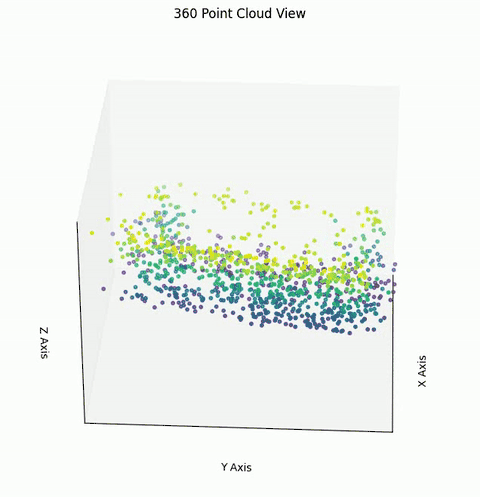 |

| Sample 15 | Sample 16 | Sample 17 |
|---|---|---|
| 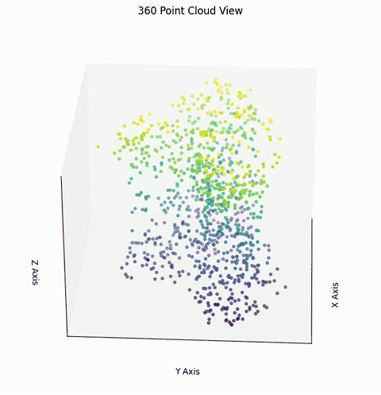 | 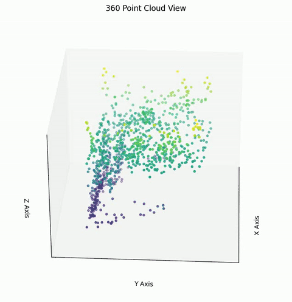 | 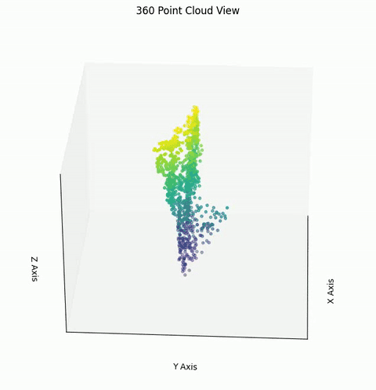 |

| Sample 18 | Sample 19 | Sample 20 |
|---|---|---|
| 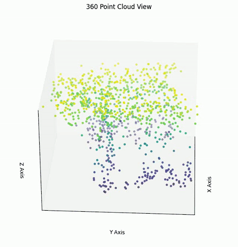 | 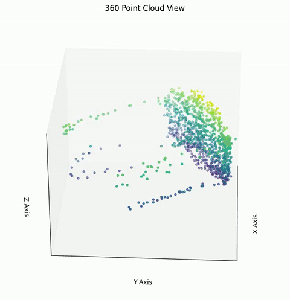 | 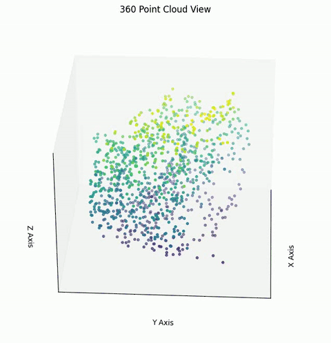 |

| Sample 21 | Sample 22 | Sample 23 |
|---|---|---|
| 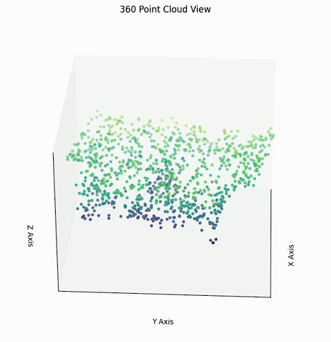 | 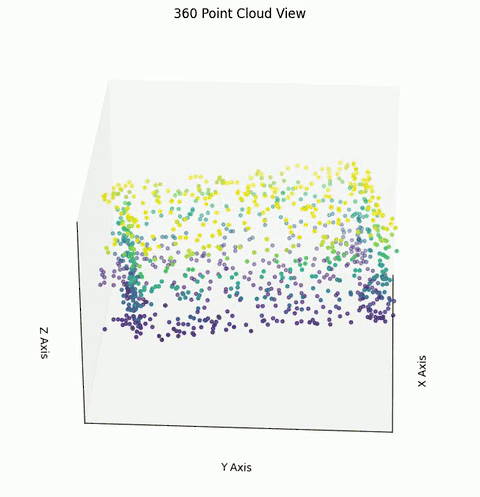 | 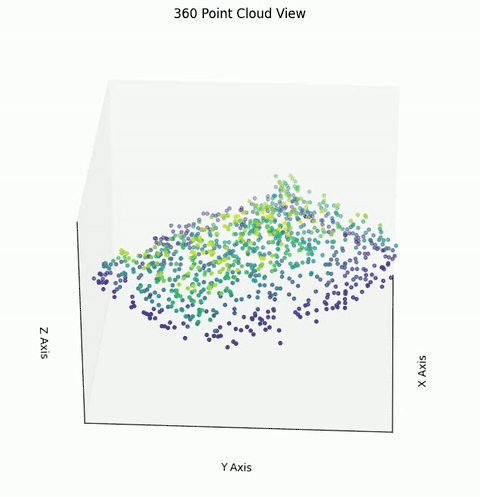 |

| Sample 24 | Sample 25 | Sample 26 |
|---|---|---|
| 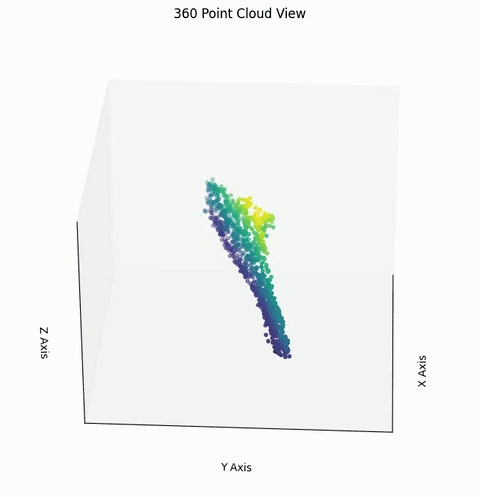 | 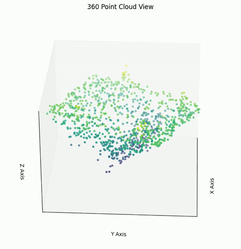 | 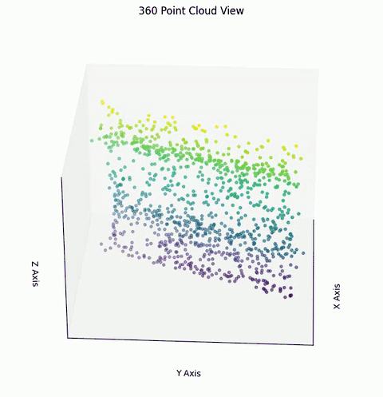 |


## 4) Acknowledgement
- https://github.com/LTH14/mar
